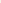

# Registro de Estudiantes — Qt Widgets

Aplicación de escritorio desarrollada en C++ con Qt 6 para registrar estudiantes. El proyecto emplea `QWidget`, `QFormLayout`, señales y slots, validación de campos y un historial de registros durante la sesión.

## Funcionalidades

- Registro de estudiantes con nombre y código.
- Validación visual de campos obligatorios.
- Botón para limpiar el formulario.
- Historial de registros con filas alternadas.
- Registro con el botón o al presionar Enter en el campo de código.
- Contador dinámico de estudiantes registrados.
- Interfaz con estilo brutalista y una paleta consistente de negro, naranja y verde ácido.

## Capturas



## Compilación

```bash
cmake -S . -B build -G Ninja -DCMAKE_BUILD_TYPE=Debug
cmake --build build
./build/RegistroEstudiantes
```

## Estructura

- `VentanaRegistro.*`: interfaz, señales, slots y lógica visual.
- `Estudiante.*`: clase de dominio y contador de creación de objetos.
- `main.cpp`: punto de entrada de la aplicación.
